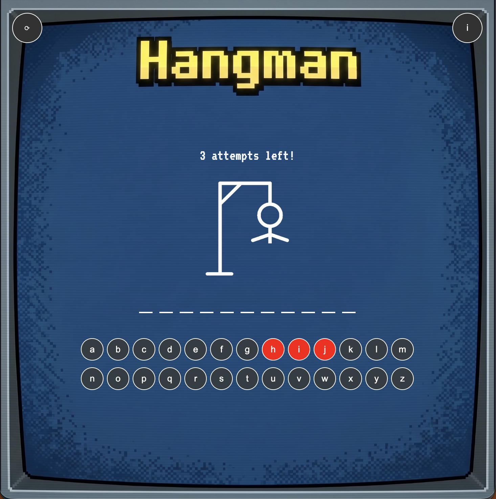

# Spaceman Game

A simple game to add excitment and challgene in your way to guess random words! 



## Getting Started 

### Play the Game
[Deployed Game](https://3sfoor102.github.io/spaceman-game/)

### How to Play
1. Click or press any button to start  
2. Try to guess the secret word
3. Look at your attempts to avoid losing
4. If the round ended click restart icon to play again 


### Installation 
No Installation required! Simply clone the repo to your machine and open the `index.html` in your browser 

```bash
git clone
cd memory
open index.html
```

### Technologies Used 
- HTML
- CSS
- JavaScript

### Future Enhancments 
- Adding more levels 
- Enhancing design
- Adding side challenges
- Adding points/score
  

### Credits
- Credits goes to my GA instructor, and to my GA instructors associates 
